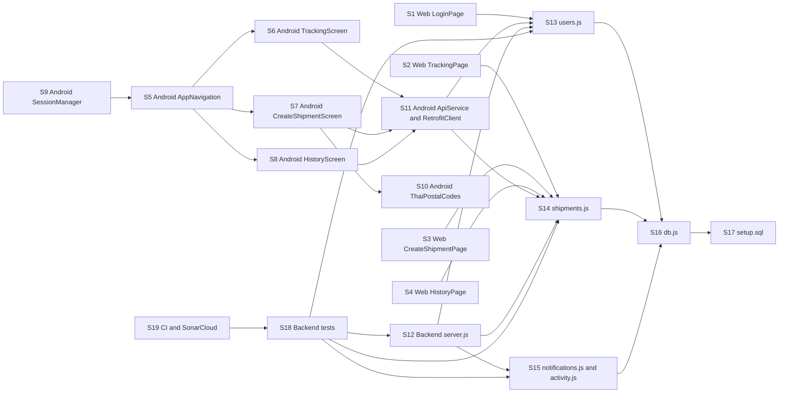

# D4: Impact Analysis

This document analyzes the impact of the Phase 2 maintenance work for Arai-Kor-Dai's **Smart Post & Parcel Management System**. It is updated to match the revised `D3_CHANGE_REQUESTS.md` version with 9 change requests.

## 1. Scope of Impact Analysis

### Phase 2 Features

| ID | Feature | Summary |
|---|---|---|
| F1 | Native Android Mobile Client App | Add a native Android client that includes the user-facing functions of the original web application: login, registration, dashboard, create shipment, payment, shipping label, tracking, history, and settings. |
| F2 | Parcel Status Tracking Page | Allow users to enter a tracking number and view the latest parcel status on both web and Android. |
| F3 | Address Auto-fill and Validation | Auto-fill address information from Thai postal codes and validate postal-code input on both web and Android. |

### Change Requests Used in This Analysis

| CR | Change request | Maintenance type | Main affected area |
|---|---|---|---|
| CR-01 | Fix Web Login to Use Real Backend Authentication | Corrective | Web login, user API, session storage |
| CR-02 | Correct Backend Route Logic After Database Conversion | Adaptive | Backend routes, PostgreSQL query syntax |
| CR-03 | Support Parcel Status Tracking With Cloud Database | Adaptive | Shipment tracking API, database |
| CR-04 | Adapt the System for Cloud Deployment on Render | Adaptive | Web API URL, Android API URL, backend deployment |
| CR-05 | Implement Native Android Mobile Client (Feature 1) | Perfective | Android app screens, navigation, Retrofit API, DataStore session |
| CR-06 | Add Thai Postal Code Address Auto-fill and Validation | Perfective | Web create-shipment form, Android create-shipment form, postal-code lookup |
| CR-07 | Add Automated Backend Test Suite and Coverage | Preventive | Backend route tests, server testability |
| CR-08 | Add CI Pipeline and SonarCloud Quality Monitoring | Preventive | GitHub Actions, SonarCloud configuration |
| CR-09 | Fix Cross-User Data Leak on the History Page | Corrective | Web history page, authenticated user ID, shipment history API |

## 2. Full Traceability Graph

The graph below shows the full traceability view from feature requests, to design-level containers, to code modules, to tests and quality checks.

```mermaid
flowchart TD
  F1["F1 Native Android Mobile Client"]
  F2["F2 Parcel Status Tracking Page"]
  F3["F3 Address Auto-fill and Validation"]

  D_WEB["Design: Web Application Container"]
  D_ANDROID["Design: Android Mobile App Container"]
  D_BACKEND["Design: Express Backend API Container"]
  D_DB["Design: PostgreSQL Database Container"]
  D_CI["Design: CI and SonarCloud Quality Pipeline"]

  C_WEB_LOGIN["Code: Web LoginPage.jsx"]
  C_WEB_TRACK["Code: Web TrackingPage.jsx"]
  C_WEB_CREATE["Code: Web CreateShipmentPage.jsx"]
  C_WEB_HISTORY["Code: Web HistoryPage.jsx"]
  C_ANDROID_NAV["Code: Android AppNavigation.kt"]
  C_ANDROID_TRACK["Code: Android TrackingScreen.kt"]
  C_ANDROID_CREATE["Code: Android CreateShipmentScreen.kt"]
  C_ANDROID_HISTORY["Code: Android HistoryScreen.kt"]
  C_ANDROID_SESSION["Code: Android SessionManager.kt"]
  C_ANDROID_ZIP["Code: Android ThaiPostalCodes.kt"]
  C_ANDROID_API["Code: Android ApiService.kt and RetrofitClient.kt"]
  C_BACKEND_SERVER["Code: Backend server.js"]
  C_BACKEND_DB["Code: Backend db.js"]
  C_BACKEND_USERS["Code: Backend routes/users.js"]
  C_BACKEND_SHIPMENTS["Code: Backend routes/shipments.js"]
  C_BACKEND_NOTIFICATIONS["Code: Backend routes/notifications.js"]
  C_BACKEND_ACTIVITY["Code: Backend routes/activity.js"]
  C_DB_SCHEMA["Code: setup.sql"]
  C_CI["Code: .github/workflows/ci.yml"]
  C_SONAR["Code: sonar-project.properties"]

  T_BACKEND["Tests: Jest and Supertest backend route tests"]
  T_ANDROID_ZIP["Tests: Android ThaiPostalCodesTest.kt"]
  T_ANDROID_API["Tests: Android RetrofitClientTest.kt"]
  T_MANUAL["Tests: Manual web and Android walkthrough"]
  T_HISTORY["Tests: Two-account history isolation check"]
  T_SONAR["Quality: SonarCloud analysis and coverage report"]

  F1 --> D_ANDROID
  F1 --> D_BACKEND
  F1 --> D_CI
  F2 --> D_WEB
  F2 --> D_ANDROID
  F2 --> D_BACKEND
  F2 --> D_DB
  F3 --> D_WEB
  F3 --> D_ANDROID

  D_WEB --> C_WEB_LOGIN
  D_WEB --> C_WEB_TRACK
  D_WEB --> C_WEB_CREATE
  D_WEB --> C_WEB_HISTORY
  D_ANDROID --> C_ANDROID_NAV
  D_ANDROID --> C_ANDROID_TRACK
  D_ANDROID --> C_ANDROID_CREATE
  D_ANDROID --> C_ANDROID_HISTORY
  D_ANDROID --> C_ANDROID_SESSION
  D_ANDROID --> C_ANDROID_ZIP
  D_ANDROID --> C_ANDROID_API
  D_BACKEND --> C_BACKEND_SERVER
  D_BACKEND --> C_BACKEND_DB
  D_BACKEND --> C_BACKEND_USERS
  D_BACKEND --> C_BACKEND_SHIPMENTS
  D_BACKEND --> C_BACKEND_NOTIFICATIONS
  D_BACKEND --> C_BACKEND_ACTIVITY
  D_DB --> C_DB_SCHEMA
  D_CI --> C_CI
  D_CI --> C_SONAR

  C_WEB_LOGIN --> C_BACKEND_USERS
  C_WEB_TRACK --> C_BACKEND_SHIPMENTS
  C_WEB_CREATE --> C_BACKEND_SHIPMENTS
  C_WEB_HISTORY --> C_BACKEND_SHIPMENTS
  C_ANDROID_NAV --> C_ANDROID_TRACK
  C_ANDROID_NAV --> C_ANDROID_CREATE
  C_ANDROID_NAV --> C_ANDROID_HISTORY
  C_ANDROID_TRACK --> C_ANDROID_API
  C_ANDROID_CREATE --> C_ANDROID_API
  C_ANDROID_CREATE --> C_ANDROID_ZIP
  C_ANDROID_HISTORY --> C_ANDROID_API
  C_ANDROID_SESSION --> C_ANDROID_NAV
  C_ANDROID_API --> C_BACKEND_SHIPMENTS
  C_ANDROID_API --> C_BACKEND_USERS
  C_BACKEND_SERVER --> C_BACKEND_USERS
  C_BACKEND_SERVER --> C_BACKEND_SHIPMENTS
  C_BACKEND_SERVER --> C_BACKEND_NOTIFICATIONS
  C_BACKEND_SERVER --> C_BACKEND_ACTIVITY
  C_BACKEND_USERS --> C_BACKEND_DB
  C_BACKEND_SHIPMENTS --> C_BACKEND_DB
  C_BACKEND_NOTIFICATIONS --> C_BACKEND_DB
  C_BACKEND_ACTIVITY --> C_BACKEND_DB
  C_BACKEND_DB --> C_DB_SCHEMA
  C_CI --> T_BACKEND
  C_CI --> T_SONAR
  C_SONAR --> T_SONAR
  C_BACKEND_SERVER --> T_BACKEND
  C_BACKEND_USERS --> T_BACKEND
  C_BACKEND_SHIPMENTS --> T_BACKEND
  C_BACKEND_NOTIFICATIONS --> T_BACKEND
  C_BACKEND_ACTIVITY --> T_BACKEND
  C_ANDROID_ZIP --> T_ANDROID_ZIP
  C_ANDROID_API --> T_ANDROID_API
  C_WEB_TRACK --> T_MANUAL
  C_WEB_CREATE --> T_MANUAL
  C_WEB_HISTORY --> T_HISTORY
  C_ANDROID_TRACK --> T_MANUAL
  C_ANDROID_CREATE --> T_MANUAL
  C_ANDROID_HISTORY --> T_MANUAL
```

## 3. Affected-Only Traceability Graph

This graph filters the traceability view to only the parts affected by the revised Phase 2 change requests.

```mermaid
flowchart TD
  F1["F1 Android Client"]
  F2["F2 Parcel Tracking"]
  F3["F3 Address Auto-fill"]

  CR01["CR-01 Web Login Auth Fix"]
  CR02["CR-02 Backend PostgreSQL Route Fixes"]
  CR03["CR-03 Tracking With Cloud Database"]
  CR04["CR-04 Render Cloud Deployment"]
  CR05["CR-05 Native Android Mobile Client"]
  CR06["CR-06 Postal Code Auto-fill"]
  CR07["CR-07 Backend Tests"]
  CR08["CR-08 CI and SonarCloud"]
  CR09["CR-09 History Page Data Leak Fix"]

  WEB_LOGIN["Web LoginPage.jsx"]
  WEB_TRACK["Web TrackingPage.jsx"]
  WEB_CREATE["Web CreateShipmentPage.jsx"]
  WEB_HISTORY["Web HistoryPage.jsx"]
  AND_NAV["Android AppNavigation.kt"]
  AND_TRACK["Android TrackingScreen.kt"]
  AND_CREATE["Android CreateShipmentScreen.kt"]
  AND_HISTORY["Android HistoryScreen.kt"]
  AND_SESSION["Android SessionManager.kt"]
  AND_ZIP["Android ThaiPostalCodes.kt"]
  AND_API["Android ApiService.kt and RetrofitClient.kt"]
  SERVER["Backend server.js"]
  DB["Backend db.js"]
  USERS["Backend routes/users.js"]
  SHIPMENTS["Backend routes/shipments.js"]
  NOTIFICATIONS["Backend routes/notifications.js"]
  ACTIVITY["Backend routes/activity.js"]
  SCHEMA["PostgreSQL setup.sql"]
  TESTS["Jest and Supertest tests"]
  AND_TESTS["Android unit tests"]
  CI["GitHub Actions workflow"]
  SONAR["SonarCloud configuration"]
  HISTORY_CHECK["Two-account history isolation check"]

  F1 --> CR04
  F1 --> CR05
  F2 --> CR03
  F2 --> CR05
  F3 --> CR06

  CR01 --> WEB_LOGIN
  CR01 --> USERS
  CR02 --> USERS
  CR02 --> SHIPMENTS
  CR02 --> NOTIFICATIONS
  CR02 --> ACTIVITY
  CR02 --> DB
  CR03 --> WEB_TRACK
  CR03 --> AND_TRACK
  CR03 --> SHIPMENTS
  CR03 --> DB
  CR03 --> SCHEMA
  CR04 --> WEB_LOGIN
  CR04 --> WEB_TRACK
  CR04 --> WEB_CREATE
  CR04 --> WEB_HISTORY
  CR04 --> AND_API
  CR04 --> SERVER
  CR05 --> AND_NAV
  CR05 --> AND_TRACK
  CR05 --> AND_CREATE
  CR05 --> AND_HISTORY
  CR05 --> AND_SESSION
  CR05 --> AND_API
  CR06 --> WEB_CREATE
  CR06 --> AND_CREATE
  CR06 --> AND_ZIP
  CR07 --> SERVER
  CR07 --> USERS
  CR07 --> SHIPMENTS
  CR07 --> NOTIFICATIONS
  CR07 --> ACTIVITY
  CR07 --> TESTS
  CR08 --> CI
  CR08 --> SONAR
  CR08 --> TESTS
  CR09 --> WEB_HISTORY
  CR09 --> SHIPMENTS
  CR09 --> HISTORY_CHECK

  WEB_LOGIN --> USERS
  WEB_TRACK --> SHIPMENTS
  WEB_CREATE --> SHIPMENTS
  WEB_HISTORY --> SHIPMENTS
  AND_NAV --> AND_TRACK
  AND_NAV --> AND_CREATE
  AND_NAV --> AND_HISTORY
  AND_SESSION --> AND_NAV
  AND_TRACK --> AND_API
  AND_CREATE --> AND_API
  AND_CREATE --> AND_ZIP
  AND_HISTORY --> AND_API
  AND_API --> USERS
  AND_API --> SHIPMENTS
  USERS --> DB
  SHIPMENTS --> DB
  NOTIFICATIONS --> DB
  ACTIVITY --> DB
  DB --> SCHEMA
  TESTS --> SERVER
  TESTS --> USERS
  TESTS --> SHIPMENTS
  TESTS --> NOTIFICATIONS
  TESTS --> ACTIVITY
  AND_TESTS --> AND_ZIP
  CI --> TESTS
  SONAR --> TESTS
```

## 4. Software Lifecycle Objects (SLOs)

For the directed SLO graph and matrix, each code module is treated as one SLO.

| SLO ID | Code module | Responsibility |
|---|---|---|
| S1 | Web `LoginPage.jsx` | Calls real backend login and stores authenticated user data. |
| S2 | Web `TrackingPage.jsx` | Lets web users search by tracking number and displays parcel status. |
| S3 | Web `CreateShipmentPage.jsx` | Creates shipments and performs web postal-code auto-fill. |
| S4 | Web `HistoryPage.jsx` | Fetches shipment history for the authenticated user. |
| S5 | Android `AppNavigation.kt` | Connects Android screens and routes users to tracking, shipment creation, history, payment, and settings. |
| S6 | Android `TrackingScreen.kt` | Lets Android users search by tracking number and displays shipment status. |
| S7 | Android `CreateShipmentScreen.kt` | Lets Android users create shipments and uses postal-code auto-fill. |
| S8 | Android `HistoryScreen.kt` | Shows Android shipment history using the shared backend. |
| S9 | Android `SessionManager.kt` | Persists Android login/session data using DataStore. |
| S10 | Android `ThaiPostalCodes.kt` | Maps Thai postal-code prefixes to provinces. |
| S11 | Android `ApiService.kt` and `RetrofitClient.kt` | Defines Android API calls to the shared backend. |
| S12 | Backend `server.js` | Creates the Express app, mounts routes, and supports test imports. |
| S13 | Backend `routes/users.js` | Handles login, registration, profile, and user statistics. |
| S14 | Backend `routes/shipments.js` | Handles shipment creation, tracking lookup, recent shipments, history, and monthly data. |
| S15 | Backend `routes/notifications.js` and `routes/activity.js` | Handles notifications and dashboard activity data. |
| S16 | Backend `db.js` | Provides PostgreSQL connection and query access. |
| S17 | Backend `setup.sql` | Defines PostgreSQL schema for users, shipments, payments, notifications, and activity logs. |
| S18 | Backend Jest/Supertest tests | Verifies route behavior and error handling. |
| S19 | CI and SonarCloud configuration | Runs builds, tests, coverage upload, and SonarCloud analysis. |

## 5. Directed SLO Graph

## 6. Connectivity Matrix With Distances

Distance means the number of directed edges from the row SLO to the column SLO. `0` means the same SLO, `1` means directly connected, `2` means reachable through one intermediate SLO, and `-` means no directed path was identified in this impact model.

| From / To | S1 | S2 | S3 | S4 | S5 | S6 | S7 | S8 | S9 | S10 | S11 | S12 | S13 | S14 | S15 | S16 | S17 | S18 | S19 |
|---        |1. |2. |3. |4. |5  |6. |7. |8. |9. |10.|11 |12 |13.|14.|15.|16.|17.|18.|19.|
| S1        | 0 | - | - | - | - | - | - | - | - | - | - | - | 1 | - | - | 2 | 3 | - | - |
| S2        | - | 0 | - | - | - | - | - | - | - | - | - | - | - | 1 | - | 2 | 3 | - | - |
| S3        | - | - | 0 | - | - | - | - | - | - | - | - | - | - | 1 | - | 2 | 3 | - | - |
| S4        | - | - | - | 0 | - | - | - | - | - | - | - | - | - | 1 | - | 2 | 3 | - | - |
| S5        | - | - | - | - | 0 | 1 | 1 | 1 | - | 2 | 2 | - | 3 | 3 | - | 4 | 5 | - | - |
| S6        | - | - | - | - | - | 0 | - | - | - | - | 1 | - | 2 | 2 | - | 3 | 4 | - | - |
| S7        | - | - | - | - | - | - | 0 | - | - | 1 | 1 | - | 2 | 2 | - | 3 | 4 | - | - |
| S8        | - | - | - | - | - | - | - | 0 | - | - | 1 | - | 2 | 2 | - | 3 | 4 | - | - |
| S9        | - | - | - | - | 1 | 2 | 2 | 2 | 0 | 3 | 3 | - | 4 | 4 | - | 5 | 6 | - | - |
| S10       | - | - | - | - | - | - | - | - | - | 0 | - | - | - | - | - | - | - | - | - |
| S1        | - | - | - | - | - | - | - | - | - | - | 0 | - | 1 | 1 | - | 2 | 3 | - | - |
| S12       | - | - | - | - | - | - | - | - | - | - | - | 0 | 1 | 1 | 1 | 2 | 3 | - | - |
| S13       | - | - | - | - | - | - | - | - | - | - | - | - | 0 | - | - | 1 | 2 | - | - |
| S14       | - | - | - | - | - | - | - | - | - | - | - | - | - | 0 | - | 1 | 2 | - | - |
| S15       | - | - | - | - | - | - | - | - | - | - | - | - | - | - | 0 | 1 | 2 | - | - |
| S16       | - | - | - | - | - | - | - | - | - | - | - | - | - | - | - | 0 | 1 | - | - |
| S17       | - | - | - | - | - | - | - | - | - | - | - | - | - | - | - | - | 0 | - | - |
| S18       | - | - | - | - | - | - | - | - | - | - | - | 1 | 1 | 1 | 1 | 2 | 3 | 0 | - |
| S19       | - | - | - | - | - | - | - | - | - | - | - | 2 | 2 | 2 | 2 | 3 | 4 | 1 | 0 |

## 7. Impact by Change Request

| CR | Directly affected SLOs | Secondary affected SLOs | Impact summary |
|---|---|---|---|
| CR-01 | S1, S13 | S16, S17, S18, S19 | Web login now depends on real backend authentication and correct session data storage. |
| CR-02 | S13, S14, S15, S16, S17 | S1, S2, S3, S4, S6, S7, S8, S11, S18 | PostgreSQL route conversion affects every web and Android feature that reads or writes backend data. |
| CR-03 | S2, S6, S11, S14, S16, S17 | S18, S19 | Parcel tracking depends on shipment query correctness, Android Retrofit calls, and the cloud database schema. |
| CR-04 | S1, S2, S3, S4, S11, S12 | S13, S14, S15, S16, S19 | Moving from localhost to Render affects all clients that call the API and the backend startup/deployment path. |
| CR-05 | S5, S6, S7, S8, S9, S11 | S13, S14, S16, S17 | The Android app introduces a new client platform that reuses existing backend APIs and requires session, navigation, and networking support. |
| CR-06 | S3, S7, S10 | S14, S16, S17 | Postal-code auto-fill mainly affects create-shipment UI logic, but submitted shipment data still flows into backend shipment storage. |
| CR-07 | S12, S13, S14, S15, S18 | S16, S17, S19 | Automated tests require the backend app to be importable and route behavior to be deterministic. |
| CR-08 | S18, S19 | S12, S13, S14, S15, S16 | CI and SonarCloud depend on tests, coverage output, and stable project configuration. |
| CR-09 | S4, S14 | S1, S16, S17, S18 | The History page must use the logged-in user's ID instead of a hard-coded user ID, otherwise one user can see another user's shipment history. |

## 8. Easy and Difficult Change Requests

### Easy to Apply

| Change request | Reason |
|---|---|
| CR-01: Fix Web Login to Use Real Backend Authentication | The change is localized to the web login page and existing `/api/users/login` route. The main risk is whether the saved session fields match the dashboard and history pages. |
| CR-06: Add Thai Postal Code Address Auto-fill and Validation | The postal-code lookup is mostly local UI logic in the web and Android create-shipment screens. The lookup table is deterministic and easy to verify with unit tests and manual form checks. |
| CR-08: Add CI Pipeline and SonarCloud Quality Monitoring | This is mostly configuration once the build, test, and coverage commands are known. GitHub Actions repeats the same process after every push. |
| CR-09: Fix Cross-User Data Leak on the History Page | The code change is small because it replaces the hard-coded `USER_ID = 1` with the logged-in `userId` from local storage. The security impact is high, but the affected web page is narrow and easy to test with two accounts. |

### Difficult to Apply

| Change request | Reason |
|---|---|
| CR-02: Correct Backend Route Logic After Database Conversion | This affects many APIs at once because MySQL and PostgreSQL differ in placeholders, date intervals, auto-increment behavior, and returned rows. A mistake can break login, shipments, notifications, activity, tracking, or history together. |
| CR-03: Support Parcel Status Tracking With Cloud Database | Tracking depends on the database schema, deployed database availability, shipment query correctness, web UI, Android UI, and Retrofit response models. |
| CR-04: Adapt the System for Cloud Deployment on Render | Deployment changes affect environment variables, API base URLs, database credentials, backend startup behavior, and both clients. Failures may only appear after deployment. |
| CR-05: Implement Native Android Mobile Client | This is the largest feature because it creates a new native platform with nine screens, navigation, session persistence, networking, and visual consistency with the web application. |
| CR-07: Add Automated Backend Test Suite and Coverage | Tests require refactoring `server.js`, isolating database state, handling asynchronous route behavior, and preventing mock leakage between test files. |

## 9. Expectations From Previous Developers

To make maintenance easier, the previous developers should have provided:

| Expected artifact or practice | Why it would help maintenance |
|---|---|
| Clear API documentation | Android and web clients need exact endpoints, request bodies, response fields, and error formats. |
| A reliable setup guide | Database setup, environment variables, backend startup, and frontend startup should be reproducible by a maintainer. |
| Automated backend tests | Existing tests would reveal whether PostgreSQL migration, tracking, login, and shipment changes broke old behavior. |
| Consistent schema documentation | A documented data model would reduce time spent discovering what each table and column means. |
| No hard-coded user IDs in user-facing pages | The History page data leak shows why session-dependent features should not contain placeholder user IDs after handover. |
| Separation between frontend pricing/address logic and backend business logic | Shared rules would be easier to reuse across web and Android without duplicating behavior. |
| Deployment notes | The original project was localhost-focused, so cloud deployment required extra discovery and configuration work. |
| Known limitation list | Maintainers should know which features are simulated, partial, insecure, or broken before making Phase 2 changes. |
| Traceability between requirements, design, code, and tests | This would make impact analysis faster and reduce the risk of missing affected modules. |

## 10. Conclusion

The highest-impact changes are the PostgreSQL conversion, cloud deployment, native Android client, and shared tracking/history APIs because they sit on the dependency path for both the web application and Android application. The address auto-fill and History page fixes are smaller in code size, but the History page fix has high security importance because it prevents cross-user exposure of shipment history.
